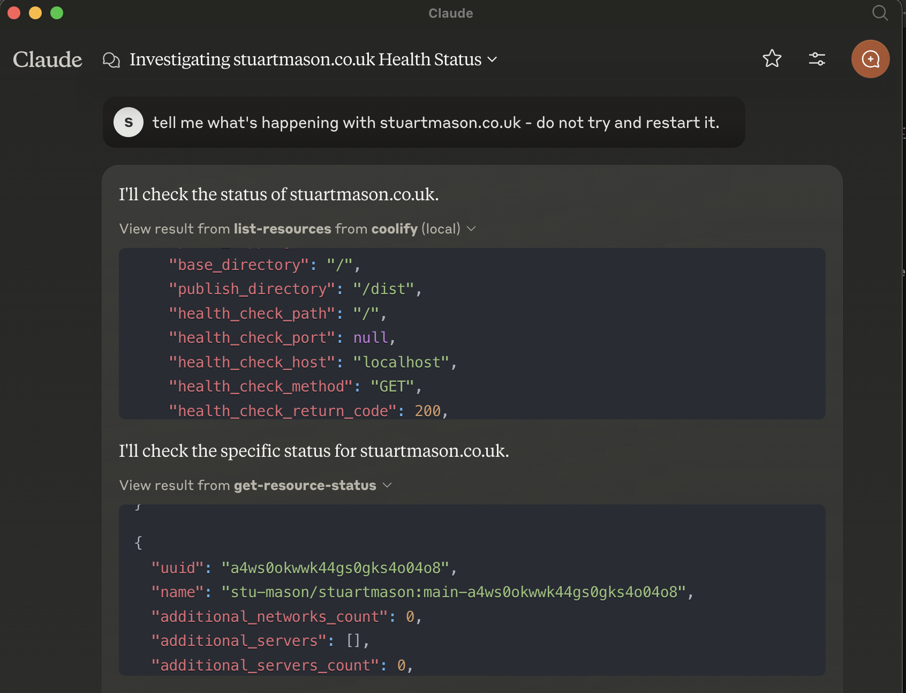
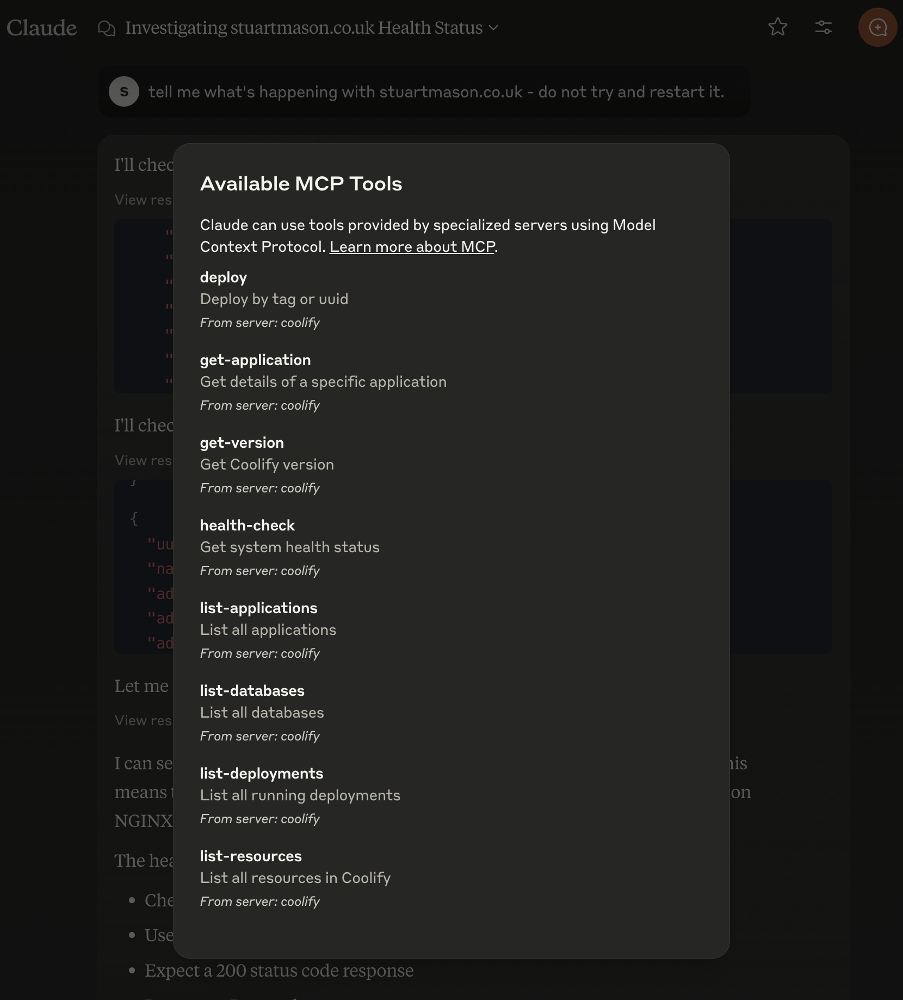

# Coolify MCP Server

## Overview

This is still very much in development. 

The Coolify MCP (Model Context Protocol) Server is an integration layer for the Coolify API, allowing users to interact with various resources and applications through a standardized interface. This server is built using TypeScript and leverages the Model Context Protocol SDK for seamless communication.





## Features

- List resources and applications
- Get details of specific applications
- Start, stop, and restart applications
- Deploy applications by tag or UUID
- Health check for system status
- Fetch the current version of the Coolify API

## Installation

To set up the Coolify MCP Server, follow these steps:

1. **Clone the repository:**

```bash
git clone <repository-url>
cd coolify-mcp
```

2. **Install dependencies:**

```bash
npm install
```

then run 

```bash
npm build
```

to create the build directory.

3. **Set Claude Config:**

You'll need something like this in your `claude_desktop_config.json` file:

```json
    "mcpServers": {
        "coolify": {
            "command": "node",
            "args": [
                "/full/path/to/mcp-coolify/build/index.js"
            ],
            "env": {
                "COOLIFY_ACCESS_TOKEN": "coolify_api_key",
                "COOLIFY_BASE_URL": "https://your-coolify-url.co.uk"
            }
        }
    }
```

## API Endpoints

The server supports the following operations:

- **List Resources**
  - **Request:** `list-resources`
  - **Response:** List of all resources in Coolify.

- **List Applications**
  - **Request:** `list-applications`
  - **Response:** List of all applications.

- **Get Application Details**
  - **Request:** `get-application`
  - **Parameters:** `{"uuid": "<application-uuid>"}`
  - **Response:** Details of the specified application.

- **Start Application**
  - **Request:** `start-application`
  - **Parameters:** `{"uuid": "<application-uuid>"}`
  - **Response:** Result of the start operation.

- **Stop Application**
  - **Request:** `stop-application`
  - **Parameters:** `{"uuid": "<application-uuid>"}`
  - **Response:** Result of the stop operation.

- **Restart Application**
  - **Request:** `restart-application`
  - **Parameters:** `{"uuid": "<application-uuid>"}`
  - **Response:** Result of the restart operation.

- **Deploy Application**
  - **Request:** `deploy`
  - **Parameters:** `{"tag": "<tag-name>", "uuid": "<application-uuid>", "force": true}`
  - **Response:** Result of the deploy operation.

- **Get Version**
  - **Request:** `get-version`
  - **Response:** Current version of the Coolify API.

- **Health Check**
  - **Request:** `health-check`
  - **Response:** System health status.

## Contributing

Contributions are welcome! Please open an issue or submit a pull request for any enhancements or bug fixes.
